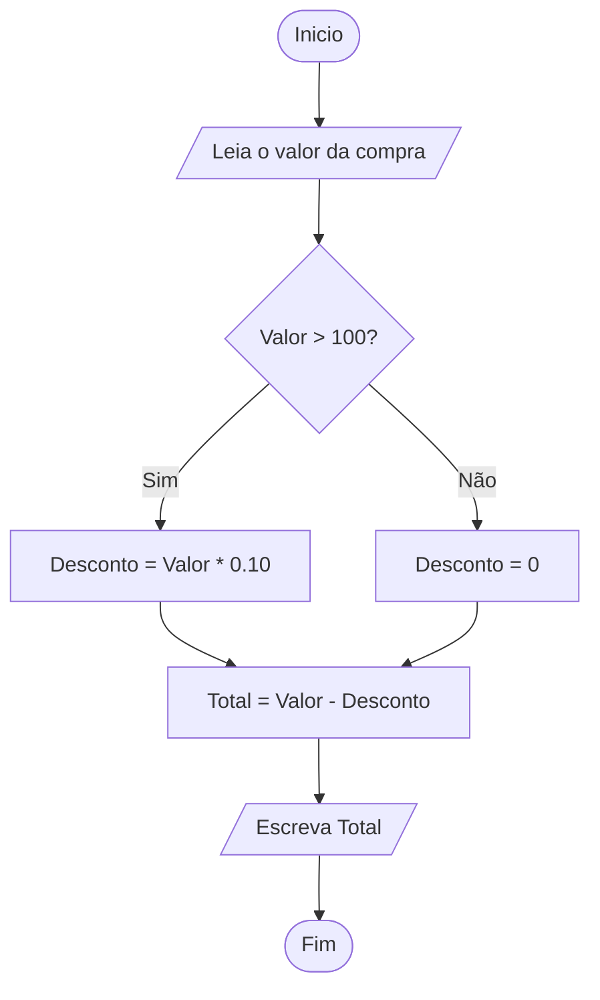

# Fluxograma

```mermaid
flowchart TD
    A([Inicio]) --> B[/Leia o valor da compra/]
    B --> C{Valor > 100?}
    C -->|Sim| D[Desconto = Valor * 0.10]
    C -->|Não| E[Desconto = 0]
	D --> F[Total = Valor - Desconto]
	E --> F
	F --> G[/Escreva Total/]
	G --> H([Fim])
```